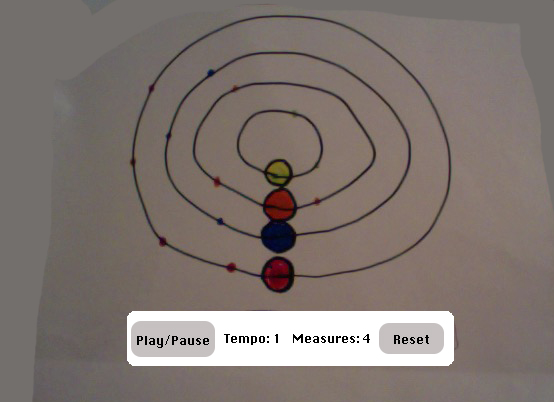

## Orbit Looper

### About

Orbital is a musical instrument for the browser. It works by looping 2, 4, or 8 measures and adding new notes to the loop as the user inputs them. Each tone has a orbital path which it follows and only produces sound when it reaches a full revolution.

### Functionality & MVP  

Orbital will allow users to:

- Start, pause, and reset the orbit looper
- Select unlimited notes to add to the looper
- Toggle the arpeggiator to play notes of their choice
- Change the number of measures in the loop and the loop tempo

In addition, this project will include:

- A production README
- Links to my LinkedIn and Github

### Wireframes

This app will consist of a single screen with the looper visualization, an options panel, nav links to the Github and my LinkedIn.  Looper controls will include a number-of-bars options input, a tempo selector input, Pause/Play and Reset buttons, and an input for tempo.

### Architecture and Technologies

This project will be implemented with the following technologies:

- JavaScript and `jQuery` for triggering of notes
- `HTML5 Canvas` and `Easel.js` for DOM manipulation and rendering
- `Tone.js` for synthesizer sounds
- Webpack to bundle and serve up the various scripts.

In addition to the webpack entry file, there will be three scripts involved in this project:

`display.js`: this script will handle the logic for creating and updating the necessary `Canvas` elements and rendering them to the DOM.

`synth.js`: this script will handle the logic for tone creation.

`looper.js`: this script will handle the triggering of notes and the syncing of the display.

### Implementation Timeline

**Day 1**: Setup all necessary Node modules, including getting webpack up and running.  Create `webpack.config.js` as well as `package.json`.  Write a basic entry file and the bare bones of all 3 scripts outlined above.  Learn the basics of `Easel.js` and `Tone.js`. Get the display rendered on the page and begin working on correctly orbiting orbs. Goals for the day:

- Get a green bundle with `webpack`
- Learn enough `Easel.js` to render an object to the `Canvas` element
- Learn enough `Tone.js` to trigger a sound on the browser
- Create renderable `ring` and `orb` objects
- Render the display and get at least one orb rotating correctly on its ring

**Day 2**: Finish logic for rotating orbs. Make sure that all rings have a correctly revolving orb and can add orbs to the orbit when clicked. Get orbs to trigger notes when they reach the 'home' point in their revolution. Goals for the day:

- Complete the `ring` and `orb` objects
- `orb` rotating speed should be based on tempo and number of bars
- Assign notes to each ring
- Give each ring a clickable button that adds another orb to orbit

**Day 3**: Add pause/play functionality. Allow `orb` objects to snap to the closest even part of the bar. Debug. Goals for the day:

- Pause looper by stopping orbs from moving
- Create algorithm for finding and snapping orbs to the closest even part of the bar

### Bonus features

- Arpeggiator
- Add options for synth sounds
- Add option for more note choices
